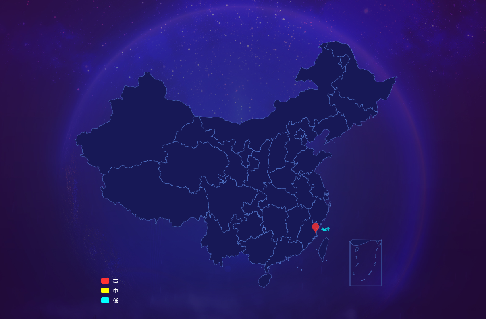
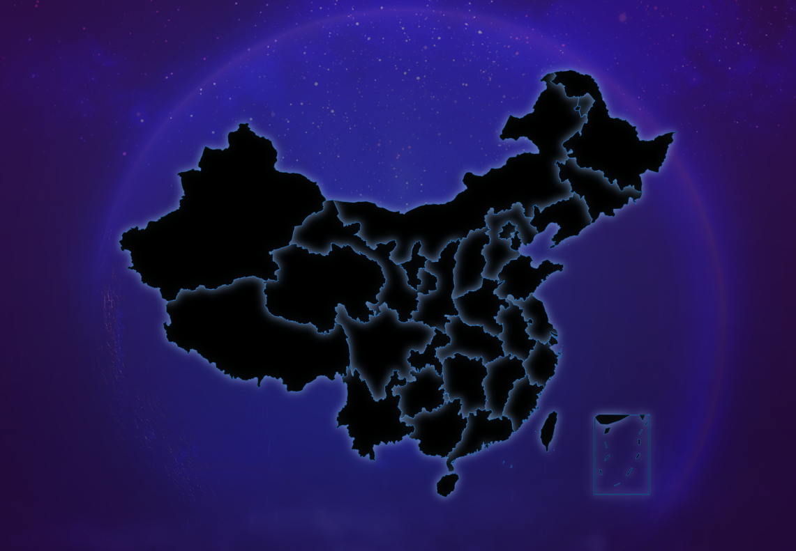
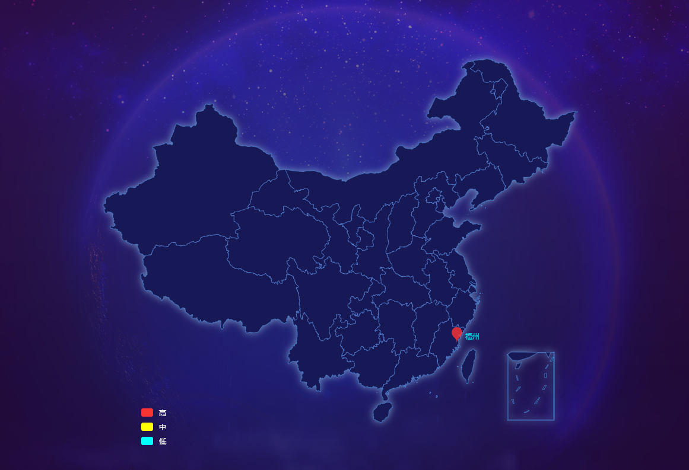
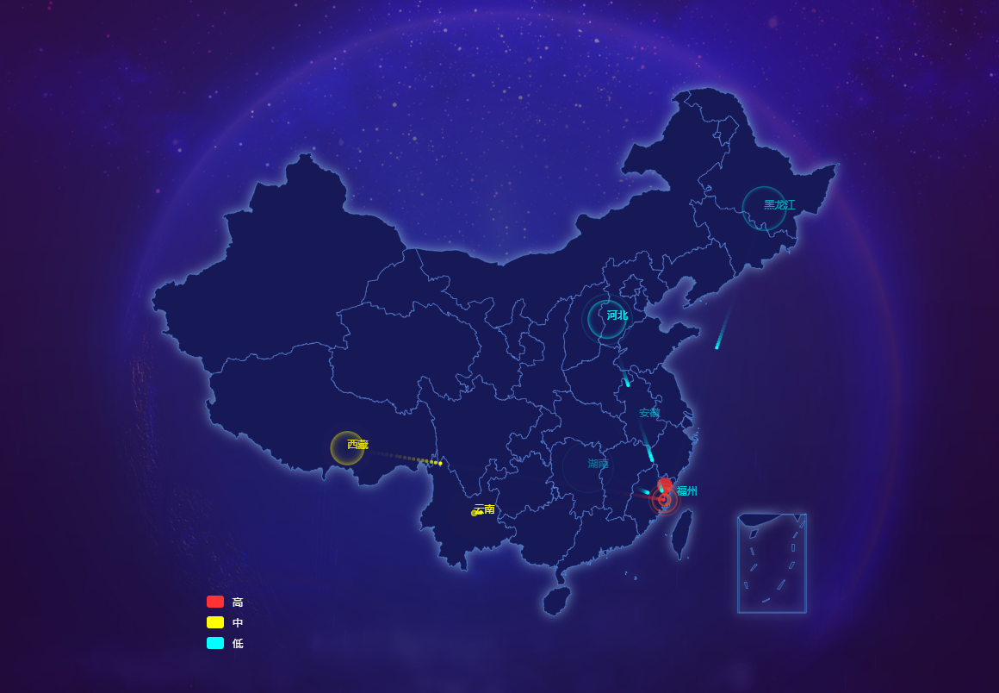

### 如何利用echart地图展示酷炫的数据可视化效果

因为工作原因，接触了很多大屏可视化的项目，多数都是利用echart展现的。对于如何利用 echart 实现各种酷炫的可视化图表，目前我还是很自信的。（echart官网地址：[http://echarts.baidu.com/index.html](http://echarts.baidu.com/index.html)）

这是一篇我利用echart中的中国地图，展现的比较酷炫的数据可视化效果。我将之分享出来，希望能够对大家有所帮助。echart官网中有很多很好看的地图展示的例子，但是没有像我分享的这种类似效果的，当初写这个效果也是费了一番功夫的哈~如果文章中存在不足之处，还请多多包涵~~~

话不多说，先上图，大家先看看效果。数据模拟展示在福州的主机受到各地的网络攻击情况。

<iframe 
  width="820"
  height="520"
  src="../js/html/threat-analysis.html"
  frameborder="0">
</iframe>

通过该图，可以一目了然的看出福州受到哪个城市的攻击，以及攻击频率（圆圈出现的频率）与等级（颜色）。

#### 以上效果是如何实现的呢？

下面，让我来一步一步说明。

#### 一、准备

在项目开始之前，首先要准备中国地图的js插件，直接在html文件中引入就好了

```html
  <script type="text/javascript" src="js/echarts.min.js"></script>
  <script type="text/javascript" src="js/china.js"></script>
```

注意：想使用`china,js`必须先引入`echart.min.js`哦~

#### 二、绘制普通的中国地图

```js
  var BJData = [];//放置需要在地图上描绘位置的数组
  var series = [];
  [
      ['福州', BJData]
  ].forEach(function(item, i) {
      series.push(
          //被攻击点
          {
              type: 'scatter',
              coordinateSystem: 'geo',
              zlevel: 2,
              rippleEffect: {
                  period: 4,
                  brushType: 'stroke',
                  scale: 4
              },
              label: {
                  normal: {
                      show: true,
                      position: 'right',
                      color: '#00ffff',
                      formatter: '{b}',
                      textStyle: {
                          color: "#00ffff"
                      }
                  },
                  emphasis: {
                      show: true
                  }
              },
              symbol: 'pin',
              symbolSize: 30,
              itemStyle: {
                  normal: {
                      show: true,
                      color: '#9966cc'
                  }
              },
              data: [{
                  name: '福州',
                  value: [119.4543, 25.9222, 3],
              }],
          }
      );
  });

  var option = {
      visualMap: {//左下角图例控制
          type: 'piecewise',
          splitNumber: 3,
          pieces: [{
              min: 0,
              max: 1,
              label:'低',
              color: 'aqua'
          }, {
              min: 1,
              max: 2,
              label:'中',
              color: 'yellow'
          }, {
              min: 3,
              max: 3,
              label:'高',
              color: '#ff3333'
          }],
          left: '160',
          bottom: '50',
          textStyle: {
              color: '#fff',
              fontSize: 12
          },
      },
      geo: {
          map: 'china',
          label: {
              emphasis: {//鼠标悬浮显示省份
                  show: true,
                  textStyle: {
                      color: "#fff"
                  }
              }
          },
          roam: true,//是否允许缩放
          itemStyle: {
              normal: {
                  color: '#171856',//地图背景色
                  borderColor: 'rgba(100,149,237,1)'//省市边界线
              },
              emphasis: {
                  color: 'rgba(37, 43, 61, .5)'//鼠标悬浮背景
              }
          }
      },

      series: series
  };
  echarts.init(ele);
```

运行后的结果如下图所示：



以上，我们可以看到，一个基础的中国地图已经画出来了。（背景为css设置的背景图）

#### 三、为地图的外围轮廓添加阴影

为了得到更加美观的效果，我希望能在整个地图的外围加上一层阴影。但是echart是无法单独为整个地图的外委轮廓的设置阴影的，所以我们要想办法，通过其他的方式来解决。以下我的方法也是参考网上的例子实现的。

我们来加上这样一些代码

```js
  {
    type: 'map',
    map: 'china',
    geoIndex: 1,
    aspectScale: 0.75, //长宽比
    showLegendSymbol: true, // 存在legend时显示
    zlevel: -1,
    label: {
        normal: {
            show: false,
        },
        emphasis: {
            textStyle: {
                color: '#fff'
            }
        }
    },
    roam: true,
    itemStyle: {
        normal: {
            areaColor: 'tansparent',
            borderColor: '#1773c3',
            // borderWidth: 1,
            shadowColor: '#7696C7',
            shadowBlur: 20
        },
        emphasis: {
            areaColor: 'transparent'
        }
    }
  }
```

这段代码单独显示的时候是什么效果呢？如下图：



我们只要在前面的代码中稍作更改：
```js
  var series = [];
```

改为

```js
var series = [
    ...//直接把上面那段代码copy过来
];
```
就可以达到下图的效果了。



#### 四、在地图上绘制攻击点以及攻击效果

目前，整个地图已经绘制出来了，接下来就需要在地图上绘制具体的攻击点以及攻击点的效果了。需要在绘制地图前，加入这些代码：

```js
var geoCoordMap = {//各个省会城市的经纬度
    '安徽': [117.17, 31.52],
    '北京': [116.24, 39.55],
    '重庆': [106.54, 29.59],
    '福建': [119.18, 26.05],
    '甘肃': [103.51, 36.04],
    '广东': [113.14, 23.08],
    '广西': [108.19, 22.48],
    '贵州': [106.42, 26.35],
    '海南': [110.20, 20.02],
    '河北': [114.30, 38.02],
    '河南': [113.40, 34.46],
    '黑龙江': [128.36, 45.44],
    '湖北': [112.27, 30.15],
    '湖南': [112.59, 28.12],
    '吉林': [125.19, 43.54],
    '江苏': [118.46, 32.03],
    '江西': [115.55, 28.40],
    '辽宁': [123.25, 41.48],
    '内蒙古': [108.41, 40.48],
    '宁夏': [106.16, 38.27],
    '青海': [101.48, 36.38],
    '山东': [118.00, 36.40],
    '山西': [112.33, 37.54],
    '陕西': [108.57, 34.17],
    '上海': [121.29, 31.14],
    '海南': [108.77, 19.10],
    '四川': [104.04, 30.40],
    '天津': [117.12, 39.02],
    '西藏': [91.08, 29.39],
    '新疆': [87.36, 43.45],
    '云南': [102.42, 25.04],
    '浙江': [120.10, 30.16],
    '澳门': [115.07, 21.33],
    '台湾': [121.21, 23.53],
    '香港': [114.15, 22.15],
    '福州': [119.4543, 25.9222],
};
var dataList = [//模拟显示的攻击点已经攻击级别数据
  {"dangerLevel":"1","province":"河北"},
  {"dangerLevel":"1","province":"河北"},
  {"dangerLevel":"1","province":"河北"},
  {"dangerLevel":"2","province":"西藏"},
  {"dangerLevel":"2","province":"云南"},
  {"dangerLevel":"3","province":"西藏"},
  {"dangerLevel":"1","province":"湖南"},
  {"dangerLevel":"1","province":"安徽"},
  {"dangerLevel":"1","province":"黑龙江"}
]
var myChart = echarts.getInstanceByDom(ele);

if (!myChart) {
    self.initChinaMapChart(ele);
} else {
    var i = -1;
    var zr = myChart.getZr();//调用底层zRender对象画图
    timer = setInterval(doani, 300)//通过定时器，对数据中的每一个点进行绘制
}

function doani() {
    i++;
    var seriesModel = myChart.getModel().getSeries()[0];
    var coordSys = seriesModel.coordinateSystem;
    var color = 'aqua';
    if (i < dataList.length) {
        if (dataList[i].dangerLevel == 2) {//根据不同等级显示颜色
            color = 'yellow';
        } else if (dataList[i].dangerLevel == 3) {
            color = '#ff3333';
        }
        var province = dataList[i].province;
        var geo = geoCoordMap[province];
        var point1 = coordSys.dataToPoint(geo);
        var point3 = coordSys.dataToPoint(geo);
        var point2 = coordSys.dataToPoint([119.4543, 25.9222]);
        var t = Math.floor(Math.random() * (2000 - 1000) + 1000)
        // var r = Math.floor(Math.random() * (100 - 50) + 50)
        //尾巴的相关设置
        var circle = new echarts.graphic.Circle({
            position: point1,
            scale: [1, 1],
            shape: {
                cx: 0,
                cy: 0,
                r: 2
            },
            style: {
                fill: color
            },
            zlevel: 3
        });
        //圆环的相关设置
        var circle2 = new echarts.graphic.Circle({
            position: point2,
            scale: [1, 1],
            shape: {
                cx: 0,
                cy: 0,
                r: 0
            },
            style: {
                fill: 'none',
                stroke: '#fe4f16',
                opacity: 1,
            },
            zlevel: 3
        });
        var circle3 = new echarts.graphic.Circle({
            position: point3,
            scale: [1, 1],
            shape: {
                cx: 0,
                cy: 0,
                r: 0
            },
            style: {
                fill: 'none',
                stroke: color,
                opacity: 1,
            },
            zlevel: 3
        });
        var text = new echarts.graphic.Text({
                position: point3,
                style: {
                    text: province,
                    fill: color,
                    textAlign: 'left',
                }
            }
        );

        /*动态模糊*/
        zr.configLayer(3, {
            motionBlur: true,
            lastFrameAlpha: 0.8,
        });

        /*动画部分*/
        circle3.animateTo({
            shape: {
                cx: 0,
                cy: 0,
                r: 30
            },
            style: {
                fill: 'none',
                stroke: color,
                opacity: 0,
            },
        }, t, 'cubicOut');
        text.animateTo({
            style: {
                opacity: 0,
            },
        }, 5000, 'cubicOut');
        circle.animate('', false)
            .when(t, {
                position: point2
            })
            .start()
            .done(function () {
                zr.remove(circle);
                circle2.animateTo({
                    shape: {
                        cx: 0,
                        cy: 0,
                        r: 20
                    },
                    style: {
                        fill: 'none',
                        stroke: '#fe4f16',
                        opacity: 0,
                    },
                }, t, 'cubicOut')
            });
        zr.add(circle2);
        zr.add(circle);
        zr.add(circle3);
        zr.add(text);
    } else {
        clearInterval(timer);
    }
}

```

加上以上代码，就能实现下图中的最终效果了



以上就是我的分享了，希望能对大家有所帮助~~~O(∩_∩)O